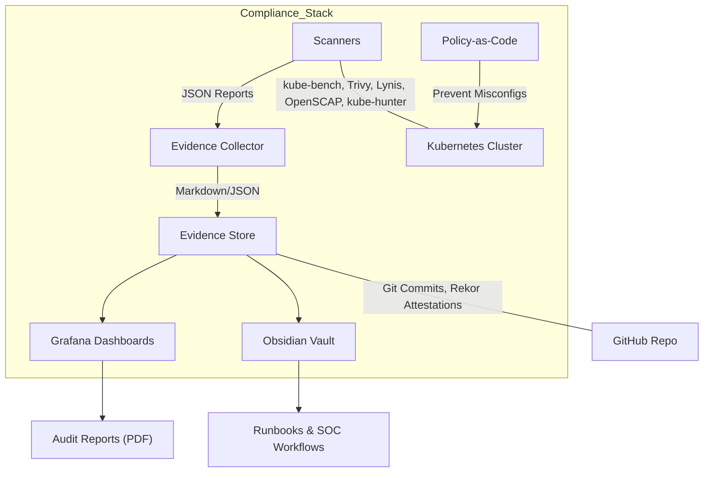

# 🛡️ Homelab Compliance Automation (Vanta-like, Self-Hosted)

> A self-hosted **compliance automation platform** built into the FatTwin homelab.  
> Inspired by Vanta/Drata, but powered by **open-source scanners, policy-as-code, and automated evidence collection**.


---

## 🌟 Features

- ✅ **Continuous Scanning** — kube-bench, Trivy, Lynis, OpenSCAP, kube-hunter  
- 📑 **Evidence Collection** — Ansible playbooks (Proxmox, OPNsense, Authentik), JSON→Markdown exporter  
- 📊 **Dashboards** — Grafana scorecards & trends, Wazuh compliance modules  
- 🔒 **Policy-as-Code** — Kyverno, OPA/Conftest, Falco runtime rules  
- 🗂 **Audit Trail** — Immutable Git commits, optional Rekor transparency log  
- 🤖 **Automation** — GitHub Actions + n8n workflows for weekly scans & quarterly signed reports  

---

## 🏗️ Architecture Overview



---

## 🔧 Tech Stack (Vanta vs Homelab)

| Capability              | Vanta SaaS            | Self-Hosted Equivalent                 |
|-------------------------|-----------------------|----------------------------------------|
| Continuous Monitoring   | Agent integrations    | kube-bench, Trivy, Lynis, OpenSCAP     |
| Evidence Collection     | Automated screenshots | Ansible playbooks, JSON→Markdown       |
| Compliance Frameworks   | SOC2, ISO, HIPAA      | CIS Benchmarks, NIST 800-53, PCI DSS   |
| Dashboards & Alerts     | Vanta UI              | Grafana + Wazuh                        |
| Policy Enforcement      | SaaS Rules            | Kyverno + OPA/Conftest + Falco         |
| Audit Trail             | Cloud portal          | Git history + Rekor transparency log   |
| Automation              | Vanta workflows       | GitHub Actions + n8n                   |

---

## 🚀 Quickstart

1. **Deploy Scanners**
   ```bash
   kubectl apply -f compliance-automation/scanners/kube-bench/kube-bench-daemonset.yaml
   helm install trivy-operator aqua/trivy-operator -f compliance-automation/scanners/trivy-operator/values.yaml
   ```

2. **Run Evidence Collection**
   ```bash
   ansible-playbook compliance-automation/evidence-collector/ansible-playbooks/proxmox.yml
   python3 compliance-automation/evidence-collector/exporters/json_to_md.py
   ```

3. **View Dashboards**
   - Import Grafana JSONs from `dashboards/grafana/`
   - Wazuh → enable compliance module

4. **Enable CI Workflows**
   - `.github/workflows/weekly-compliance.yml` runs scans weekly
   - `.github/workflows/evidence-commit.yml` commits summaries
   - `.github/workflows/report-publish.yml` generates signed audit reports

---

## 📅 Roadmap

- [x] Repo structure & scaffolding
- [x] kube-bench / Trivy Operator setup
- [x] JSON→Markdown exporter for Obsidian
- [ ] Ansible evidence collectors (Proxmox, OPNsense, Authentik)
- [ ] Grafana scorecards wired to scan data
- [ ] Kyverno baseline/restricted policies
- [ ] Conftest CI/CD gates
- [ ] Rekor transparency log integration
- [ ] Quarterly signed PDF reports

---

## 📊 Example Dashboard (Grafana)


---

## 📜 Audit Workflow

1. Run scheduled scanners (weekly).
2. Evidence auto-committed to repo + summarized in Obsidian.
3. Grafana dashboards show compliance trends.
4. Quarterly: generate **signed PDF report** + Rekor attestations.

---

## 🧑‍💻 Maintainer

Jacob Harrison — *Homelab Compliance & SOC Architect*  
[LinkedIn](https://www.linkedin.com/in/jacob-harrison-bb4871153) | [ProtonMail](mailto:harrison9.30@protonmail.com)

---

  

